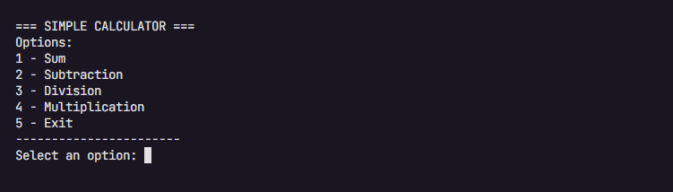

# Simple Calculator



## 💻 About

This is a console application made in C# with .Net 3.1 Framework of a simple calculator with arithmetic operations of addition, subtraction, division and multiplication.

## 🚀 How to run

### Prerequisites

Before starting, you will need to have the following tools installed on your machine:

- [Git](https://git-scm.com/)
- [Visual Studio Code](https://code.visualstudio.com/)
- [.NET 3.1](https://dotnet.microsoft.com/en-us/)

### Cloning repository

To clone this repository on your machine, just use the command below:
```bash
git clone https://github.com/bruno-candia/simple-calculator.git
```

### Restoring application packages
In your shell run the following command to restore all the packages the application needs.
```powershell
dotnet restore
```

### Compiling the application
```powershell
dotnet build
```
After running the above command, a folder will be created **bin** will be created in your project.
  
### Running an application
```powershell
dotnet run
```
This command will compile and run the application.
  
----

## 📁 File Tree
```bash
📦Calculator
 ┣ 📂obj
 ┃ ┣ 📂Debug
 ┃ ┃ ┗ 📂netcoreapp3.1
 ┃ ┃ ┃ ┣ 📜.NETCoreApp,Version=v3.1.AssemblyAttributes.cs
 ┃ ┃ ┃ ┣ 📜apphost.exe
 ┃ ┃ ┃ ┣ 📜Calculator.AssemblyInfo.cs
 ┃ ┃ ┃ ┣ 📜Calculator.AssemblyInfoInputs.cache
 ┃ ┃ ┃ ┣ 📜Calculator.assets.cache
 ┃ ┃ ┃ ┣ 📜Calculator.csproj.AssemblyReference.cache
 ┃ ┃ ┃ ┣ 📜Calculator.csproj.CoreCompileInputs.cache
 ┃ ┃ ┃ ┣ 📜Calculator.csproj.FileListAbsolute.txt
 ┃ ┃ ┃ ┣ 📜Calculator.dll
 ┃ ┃ ┃ ┣ 📜Calculator.GeneratedMSBuildEditorConfig.editorconfig
 ┃ ┃ ┃ ┣ 📜Calculator.genruntimeconfig.cache
 ┃ ┃ ┃ ┗ 📜Calculator.pdb
 ┃ ┣ 📜Calculator.csproj.nuget.dgspec.json
 ┃ ┣ 📜Calculator.csproj.nuget.g.props
 ┃ ┣ 📜Calculator.csproj.nuget.g.targets
 ┃ ┣ 📜project.assets.json
 ┃ ┗ 📜project.nuget.cache
 ┣ 📜.gitignore
 ┣ 📜Calculator.csproj
 ┣ 📜LICENSE
 ┣ 📜Program.cs
 ┗ 📜README.md

```
---

## 🛠 Technologies

### Tools and Services
- [Git](https://git-scm.com/)

### Frameworks
- [.NET 3.1](https://www.electronjs.org)

---

